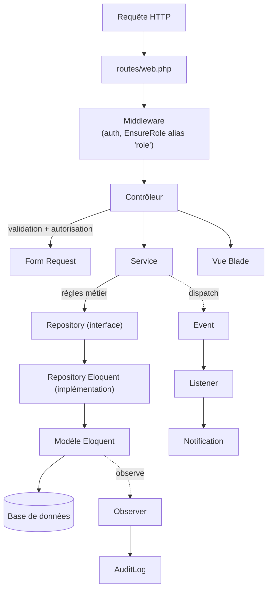

# Architecture

## Vue d'ensemble

DevTrack Pro est une application Laravel 12 monolithique, à rendu serveur (Blade), organisée en couches explicites afin de séparer le routage HTTP, la validation/autorisation, la logique métier et l'accès aux données. Le projet **n'utilise pas** d'API REST/JSON dédiée ni de SPA : toutes les routes sont déclarées dans `routes/web.php` et rendent des vues Blade (à l'exception du point de terminaison de mise à jour de statut d'une tâche, qui peut répondre en JSON — voir [Modules fonctionnels](Modules-fonctionnels)).

## Couches applicatives

### 1. Routage (`routes/web.php`, `routes/console.php`)

Toutes les routes web sont regroupées sous le middleware `auth`, à l'exception des pages de connexion. Le fichier `bootstrap/app.php` enregistre un alias de middleware `role` pointant vers `App\Http\Middleware\EnsureRole`, mais **aucune route n'applique actuellement cet alias** : l'autorisation par rôle est assurée par les **Policies** (voir plus bas), pas par ce middleware. `EnsureRole` est donc disponible mais inutilisé en l'état du code.

### 2. Contrôleurs (`app/Http/Controllers`)

Les contrôleurs sont volontairement fins : ils reçoivent la requête (validée via un Form Request si nécessaire), délèguent la logique métier à un service, puis retournent une vue ou une redirection. Ils dépendent des **interfaces** de repository (jamais des implémentations concrètes), injectées par le conteneur de services.

### 3. Form Requests (`app/Http/Requests`)

Les Form Requests portent à la fois la validation (`rules()`) et, pour certaines, l'autorisation (`authorize()`) lorsque celle-ci peut être déterminée avant l'exécution du contrôleur (ex. `StoreProjectRequest`, `StoreStageRequest`, `StoreTaskRequest`). Les cas d'autorisation dépendant d'un paramètre non déductible de la requête (ex. transition de statut d'une tâche) sont vérifiés directement dans le contrôleur via `Gate`/`can()`.

### 4. Services (`app/Services`)

Les services encapsulent les règles métier et les invariants applicatifs qui ne relèvent ni de la validation de formulaire ni de l'autorisation :

- `AuthService` : authentification (vérification des identifiants + compte actif), connexion/déconnexion.
- `DashboardService` : agrégation des indicateurs affichés sur le tableau de bord, différents selon le rôle.
- `StageService` : création d'un stage avec vérification qu'un stagiaire n'a pas déjà un stage actif.
- `ProjectService` : création/archivage d'un projet avec vérification que le stage est actif.
- `TaskService` : création de tâche, gestion des transitions de statut (machine à états), ajout de pièces jointes.
- `JournalService` : upsert d'une entrée de journal (une entrée par stagiaire et par jour).
- `ReportService` : soumission d'un rapport hebdomadaire, génération du PDF associé, émission de l'événement `WeeklyReportSubmitted`.
- `DocumentService` : dépôt d'un document et création de ses versions successives.
- `UserService` : création d'un utilisateur.

Les services ne dépendent que des **interfaces** de repository, jamais d'Eloquent directement (à l'exception des modèles passés en paramètres et des façades Laravel — `Storage`, `Auth`, `Hash`, `Pdf`).

### 5. Repositories (`app/Repositories`)

Le projet applique le **Repository Pattern** : chaque agrégat métier expose une interface (`app/Repositories/Contracts/*Interface.php`) et une implémentation Eloquent (`app/Repositories/Eloquent/Eloquent*Repository.php`). Le binding interface → implémentation est déclaré dans `App\Providers\RepositoryServiceProvider` :

| Interface | Implémentation |
|---|---|
| `UserRepositoryInterface` | `EloquentUserRepository` |
| `StageRepositoryInterface` | `EloquentStageRepository` |
| `ProjectRepositoryInterface` | `EloquentProjectRepository` |
| `TaskRepositoryInterface` | `EloquentTaskRepository` |
| `JournalRepositoryInterface` | `EloquentJournalRepository` |
| `WeeklyReportRepositoryInterface` | `EloquentWeeklyReportRepository` |
| `DocumentRepositoryInterface` | `EloquentDocumentRepository` |

Ce découplage permet de substituer une implémentation (tests, autre source de données) sans modifier les services ou contrôleurs. Il n'existe pas de repository pour `Comment` ni `AuditLog` : ces modèles sont utilisés directement via Eloquent lorsque nécessaire (aucun repository dédié n'a été créé pour eux à ce jour).

### 6. Modèles (`app/Models`)

Modèles Eloquent classiques avec `$fillable`, relations typées (`BelongsTo`, `HasMany`) et casts (`casts()` protégée, syntaxe Laravel 11+). Voir [Modèle de données](Modele-de-donnees) pour le détail.

### 7. Autorisation (`app/Policies`)

Les Policies sont résolues par **convention de nommage** (auto-discovery Laravel : `App\Models\X` ↔ `App\Policies\XPolicy`) ; aucun `Gate::policy()` explicite n'est déclaré dans le code. Elles sont appelées soit depuis les Form Requests, soit directement dans les contrôleurs via `$this->authorize()` ou `auth()->user()->can()`. Détail dans [Authentification et autorisation](Authentification-et-autorisation).

### 8. Événements, Listeners, Notifications, Observers (`app/Events`, `app/Listeners`, `app/Notifications`, `app/Observers`)

Les effets de bord (notification par e-mail/base de données, journal d'audit) sont découplés de la logique métier via le système d'événements de Laravel et un Observer Eloquent. Détail dans [Événements, notifications et tâches planifiées](Evenements-notifications-taches-planifiees).

### 9. Vues (`resources/views`)

Rendu Blade classique. Layout unique `layouts/app.blade.php` (pages authentifiées) et `layouts/guest.blade.php` (connexion), avec une barre de navigation partagée (`partials/nav.blade.php`) dont les entrées sont affichées conditionnellement selon le rôle de l'utilisateur connecté. L'interface utilise **Bootstrap 5** et **Bootstrap Icons** chargés depuis un CDN (cdnjs) directement dans le layout — la chaîne d'outils Vite/TailwindCSS présente dans `package.json`/`vite.config.js` est configurée pour le projet mais n'est actuellement utilisée que par la page `welcome.blade.php` (route `/`, non liée au cœur applicatif) ; aucune autre vue n'appelle la directive `@vite`.

## Fournisseurs de services (`app/Providers`)

- `AppServiceProvider` : enregistre l'observer `StageObserver` sur le modèle `Stage` (`boot()`).
- `RepositoryServiceProvider` : déclare les 7 bindings interface → implémentation listés ci-dessus.

Ces deux providers sont enregistrés dans `bootstrap/providers.php`.

## Patrons de conception identifiés

| Patron | Où | Objectif |
|---|---|---|
| Repository | `app/Repositories` | Isoler l'accès aux données de la logique métier |
| Service Layer | `app/Services` | Centraliser les règles métier et invariants |
| Observer | `app/Observers/StageObserver` | Journaliser automatiquement les créations/modifications de `Stage` |
| Policy-based authorization | `app/Policies` | Autorisation déclarative par action/ressource |
| Event/Listener | `app/Events`, `app/Listeners` | Découpler déclenchement métier et notification |
| Form Request | `app/Http/Requests` | Centraliser validation (et parfois autorisation) hors du contrôleur |
| State machine (transitions) | `TaskService::TRANSITIONS_AUTORISEES` | Contraindre les changements de statut d'une tâche |

## Stack technique

| Composant | Technologie | Source |
|---|---|---|
| Langage / Framework | PHP ^8.2, Laravel ^12.0 | `composer.json` |
| Base de données (dev par défaut) | SQLite (`database/database.sqlite`) | `.env.example` (`DB_CONNECTION=sqlite`) |
| Génération PDF | `barryvdh/laravel-dompdf` ^3.1 | `composer.json`, `ReportService` |
| Sessions | Driver `database` | `.env.example` |
| Files d'attente | Driver `database` (dev), `sync` en tests | `.env.example`, `phpunit.xml` |
| Frontend build | Vite 7, TailwindCSS 4 (scaffold, non branché sur l'UI actuelle) | `package.json`, `vite.config.js` |
| UI | Bootstrap 5.3.8 + Bootstrap Icons 1.11.3 (CDN) | `resources/views/layouts/app.blade.php` |
| Tests | PHPUnit ^11.5 | `composer.json`, `phpunit.xml` |
| Qualité de code | Laravel Pint | `composer.json` (dev) |
| Débogage | Laravel Debugbar, Laravel Pail | `composer.json` (dev) |
