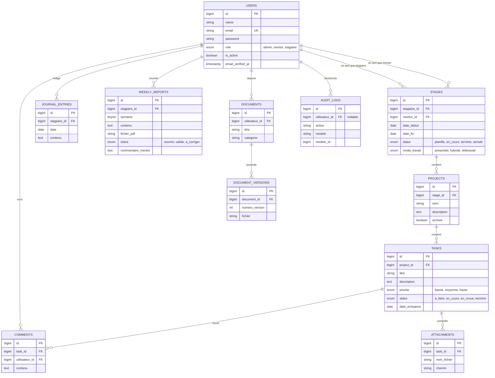

# Modèle de données

Cette page documente le schéma relationnel tel que défini par les migrations dans `database/migrations/`. Les noms de colonnes métier sont en français (convention du projet), les tables techniques (`sessions`, `cache`, `jobs`, `notifications`, ...) suivent les conventions Laravel par défaut.

## Diagramme entité-association



## Détail des tables

### `users`
Migration : `0001_01_01_000000_create_users_table.php`

| Colonne | Type | Contraintes |
|---|---|---|
| `name` | string | requis |
| `email` | string | unique |
| `email_verified_at` | timestamp | nullable |
| `password` | string | haché (cast `hashed`) |
| `role` | enum(`admin`,`mentor`,`stagiaire`) | défaut `stagiaire` |
| `is_active` | boolean | défaut `true` |
| `remember_token` | string | — |

Modèle : `App\Models\User` (étend `Authenticatable`, traits `HasFactory`, `Notifiable`). Méthodes utilitaires : `isAdmin()`, `isMentor()`, `isStagiaire()`. Relations : `stagesEnTantQueStagiaire()`, `stagesEnTantQueMentor()`, `journalEntries()`, `weeklyReports()`, `documents()`.

### `stages`
Migration : `2026_08_10_120651_create_stages_table.php`, complétée par `2026_09_19_111533_add_soft_deletes_to_stages_table.php` (ajout de `deleted_at`, trait `SoftDeletes` sur le modèle).

| Colonne | Type | Contraintes |
|---|---|---|
| `stagiaire_id` | FK → `users.id` | `cascadeOnDelete` |
| `mentor_id` | FK → `users.id` | `cascadeOnDelete` |
| `date_debut` | date | requis |
| `date_fin` | date | requis, postérieure à `date_debut` (règle de validation) |
| `statut` | enum(`planifie`,`en_cours`,`termine`,`annule`) | défaut `planifie` |
| `mode_travail` | enum(`presentiel`,`hybride`,`teletravail`) | défaut `presentiel` |
| `deleted_at` | timestamp | nullable — soft delete |

Un stagiaire ne peut avoir qu'un seul stage « actif » (`planifie` ou `en_cours`) à la fois — règle imposée par `StageService::verifierStagiaireDisponible()`, et non par une contrainte SQL. Toute création/modification d'un `Stage` déclenche `StageObserver`, qui écrit une ligne dans `audit_logs`.

**Machine à états du statut** (`StageService::TRANSITIONS_AUTORISEES`), pilotable par un admin via `PATCH /stages/{stage}/status` :

```
planifie  → en_cours | annule
en_cours  → termine  | annule
termine   → (aucune transition)
annule    → (aucune transition)
```

**Suppression** : `DELETE /stages/{stage}` (admin uniquement) applique un soft delete (`Stage` utilise `SoftDeletes`, requête de suppression exclue par défaut des listes), et est refusée par `StageService::supprimer()` tant que le statut n'est pas `termine` ou `annule`. Les `projects`/`tasks` liés au stage supprimé ne sont **jamais** supprimés ni détachés — seul le stage disparaît des listes actives.

### `projects`
Migration : `2026_08_12_101005_create_projects_table.php`

| Colonne | Type | Contraintes |
|---|---|---|
| `stage_id` | FK → `stages.id` | `cascadeOnDelete` |
| `nom` | string | requis |
| `description` | text | nullable |
| `archive` | boolean | défaut `false` |

Un projet ne peut être créé que si le stage associé a le statut `planifie` ou `en_cours` (`ProjectService::verifierStageActif()`).

### `tasks`
Migration : `2026_08_13_064112_create_tasks_table.php`

| Colonne | Type | Contraintes |
|---|---|---|
| `project_id` | FK → `projects.id` | `cascadeOnDelete` |
| `titre` | string | requis |
| `description` | text | nullable |
| `priorite` | enum(`basse`,`moyenne`,`haute`) | défaut `moyenne` |
| `statut` | enum(`a_faire`,`en_cours`,`en_revue`,`termine`) | défaut `a_faire` |
| `date_echeance` | date | nullable |

Les transitions de `statut` sont contraintes par une machine à états définie dans `TaskService::TRANSITIONS_AUTORISEES` (voir [Modules fonctionnels](Modules-fonctionnels#tâches--kanban)).

### `comments`
Migration : `2026_08_13_064305_create_comments_table.php`. FK `task_id` (cascade) et `utilisateur_id` (cascade). Modèle `App\Models\Comment` existant avec ses relations, **mais aucun contrôleur ni route n'exploite ce modèle à ce jour** (pas de `CommentController`) : la table et le modèle sont en place mais la fonctionnalité de commentaire n'est pas encore exposée côté interface/HTTP.

### `attachments`
Migration : `2026_08_13_064449_create_attachments_table.php`. FK `task_id` (cascade). Colonnes `nom_fichier` (nom d'origine) et `chemin` (chemin de stockage sur le disque `local`). Alimentée via `TaskController::storeAttachment()`.

### `journal_entries`
Migration : `2026_08_25_082941_create_journal_entries_table.php`. FK `stagiaire_id` (cascade). Contrainte unique `(stagiaire_id, date)` : une seule entrée par stagiaire et par jour (upsert géré par `JournalService::enregistrer()`).

### `weekly_reports`
Migrations : `2026_08_26_122403_create_weekly_reports_table.php` + `2026_08_26_123555_add_contenu_to_weekly_reports_table.php` (ajout ultérieur de la colonne `contenu`). Contrainte unique `(stagiaire_id, semaine)`. `semaine` est un entier compris entre 1 et 12 (règle de validation dans `WeeklyReportController::store()`). `statut` ∈ {`soumis`, `valide`, `a_corriger`} (défaut `soumis`) — mais aucune route/action ne permet actuellement à un mentor de faire évoluer ce statut ou de renseigner `commentaire_mentor` ; ces colonnes existent en base et dans le modèle sans être encore pilotées depuis l'interface.

### `documents` / `document_versions`
Migrations : `2026_09_01_073045_...` et `2026_09_01_073231_...`. Un `Document` (titre, catégorie, propriétaire) possède plusieurs `DocumentVersion` numérotées séquentiellement (`numero_version`, unique par document), chaque version référençant un fichier stocké sur le disque `local`. `Document::derniereVersion()` retourne la version la plus récente.

La colonne `categorie` reste un simple `string` nullable en base, mais sa valeur est désormais contrainte côté application à une liste fermée définie par `Document::CATEGORIES` (« Documents d'analyse », « Compte rendu », « Convention de stage »), validée par `StoreDocumentRequest` (`Rule::in(...)`) et proposée en `<select>` dans `documents/index.blade.php`.

### `notifications`
Migration : `2026_09_01_074708_create_notifications_table.php`. Table standard des notifications Laravel (clé primaire UUID, polymorphique via `notifiable_type`/`notifiable_id`, colonnes `data`, `read_at`).

### `audit_logs`
Migration : `2026_09_03_052808_create_audit_logs_table.php`. FK `utilisateur_id` nullable (`nullOnDelete`), `action` (ex. `created`, `updated`), `modele` (classe du modèle concerné, ex. `App\Models\Stage`), `modele_id`. Alimentée uniquement par `StageObserver` à ce jour — aucun autre modèle n'est observé.

### Tables techniques Laravel
`password_reset_tokens`, `sessions`, `cache`, `cache_locks`, `jobs`, `job_batches`, `failed_jobs` : générées par le squelette Laravel standard, non modifiées.

## Relations Eloquent — synthèse

| Modèle | Relations |
|---|---|
| `User` | `hasMany` Stage (×2 : stagiaire/mentor), `hasMany` JournalEntry, `hasMany` WeeklyReport, `hasMany` Document |
| `Stage` | `belongsTo` User (stagiaire), `belongsTo` User (mentor), `hasMany` Project |
| `Project` | `belongsTo` Stage, `hasMany` Task |
| `Task` | `belongsTo` Project, `hasMany` Comment, `hasMany` Attachment |
| `Comment` | `belongsTo` Task, `belongsTo` User (utilisateur) |
| `Attachment` | `belongsTo` Task |
| `JournalEntry` | `belongsTo` User (stagiaire) |
| `WeeklyReport` | `belongsTo` User (stagiaire) |
| `Document` | `belongsTo` User (utilisateur), `hasMany` DocumentVersion |
| `DocumentVersion` | `belongsTo` Document |
| `AuditLog` | `belongsTo` User (utilisateur) |

## Seed / données de démonstration

`database/seeders/DatabaseSeeder.php` crée un unique utilisateur de test (`test@example.com`, mot de passe généré par `UserFactory` = `password`, rôle par défaut `stagiaire` car non précisé). Il n'existe pas de seeder dédié pour les stages, projets ou tâches à ce jour.
